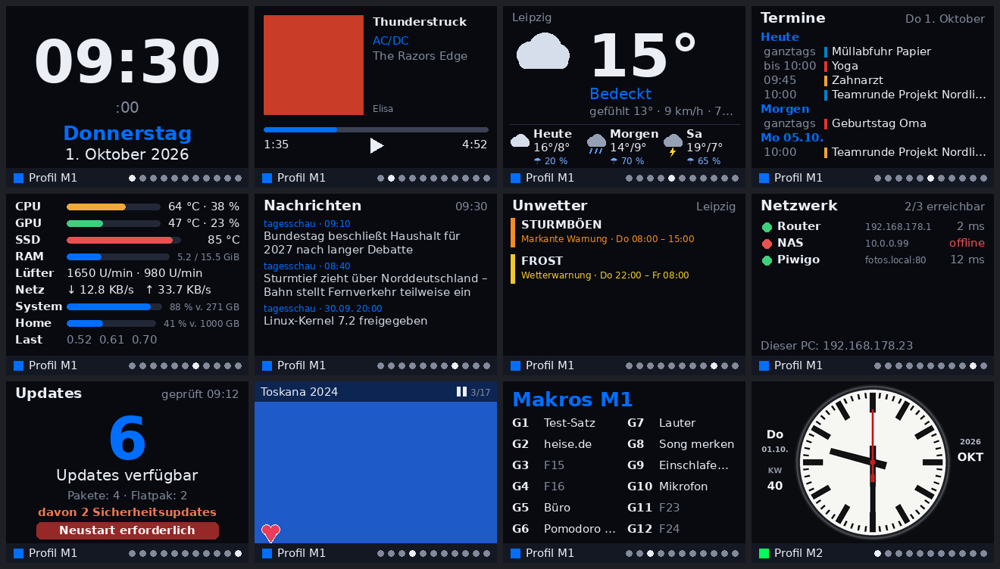
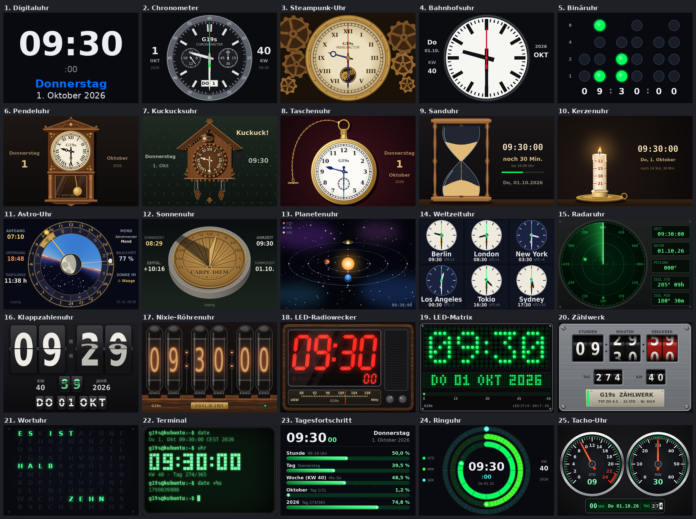
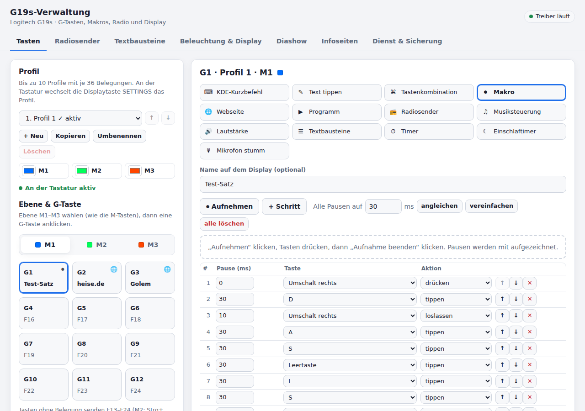

# G19s unter Kubuntu

Treiber und grafische Verwaltung für die **Logitech G19s** unter Kubuntu/KDE Plasma:
Farbdisplay, 12 G-Tasten mit drei Ebenen (M1–M3), Makros, Internetradio und vieles mehr –
ohne Logitech-Software, in zwei Python-Dateien.



## Funktionen

- **G1–G12** senden F13–F24 für KDE-Kurzbefehle oder lösen direkt Aktionen aus: Text tippen,
  Tastenkombination, Makro (auch direkt an der Tastatur mit **MR** aufnehmen), Webseite, Programm,
  Radiosender, Musiksteuerung, Lautstärke, Textbausteine, Timer/Stoppuhr/Pomodoro,
  Einschlaftimer, Mikrofon stumm
- **Bis zu 10 Profile** mit je drei Ebenen und eigenen Beleuchtungsfarben
- **Displayseiten** (je Ebene und Profil wählbar): Uhr, Musik mit Cover und Internetradio, Wetter,
  Termine (iCalendar/Nextcloud-CalDAV), Hardware, Makros, Diashow (Piwigo oder Ordner),
  Nachrichten (RSS/Atom), Unwetterwarnungen (DWD), Netzwerk, Updates
- **25 Zifferblätter** für die Uhr – von Chronometer, Bahnhofs- und Kuckucksuhr über Astro- und
  Sonnenuhr bis Nixie-Röhren und Wortuhr, Auswahl am Display mit MENU und Live-Vorschau
- Terminerinnerung, Radiowecker, Nachtmodus, Bildschirmschoner, KDE-Benachrichtigungen auf dem Display
- **G19s-Verwaltung** im Browser: Tastenbelegung, Makro-Editor, Sender, Display, Infoseiten,
  Dienst, Sicherung, Updates direkt von GitHub
- **Automatische Sicherung** in einen Ordner, auf ein NAS (SMB/WebDAV) oder in die Nextcloud





## Installation

Die ausführliche Anleitung (Pakete, udev-Regel, Autostart, Fehlerbehebung) steht in der
Wiki-Seite [`dist/G19s_unter_Kubuntu.wiki`](dist/G19s_unter_Kubuntu.wiki). Kurzfassung:

```bash
sudo apt install python3-usb python3-evdev python3-pil python3-numpy playerctl mpv mpv-mpris libnotify-bin smbclient
mkdir -p ~/.local/bin
cp dist/g19s.py dist/g19s-gui.py ~/.local/bin/
sudo cp dateien/70-g19s.rules /etc/udev/rules.d/ && sudo udevadm control --reload-rules
mkdir -p ~/.config/systemd/user && cp dateien/g19s.service ~/.config/systemd/user/
systemctl --user daemon-reload && systemctl --user enable --now g19s.service
python3 ~/.local/bin/g19s-gui.py --install-desktop     # Eintrag „G19s-Verwaltung“ im Startmenü
```

Für die Makroaufnahme zusätzlich `sudo usermod -aG input $USER`, danach den PC neu starten.
Neue Versionen holt die Verwaltung unter **Dienst & Sicherung → Nach Updates suchen**
direkt aus den [GitHub-Releases](https://github.com/MrCatwiesel/g19s-kubuntu/releases),
mit „Was ist neu“. Was sich je Version geändert hat, steht in [NEUIGKEITEN.md](NEUIGKEITEN.md).

Entwickelt für Kubuntu 26.04 mit KDE Plasma (Wayland).

## Projektaufbau

Ausgeliefert werden zwei Dateien (`dist/g19s.py`, `dist/g19s-gui.py`), die `build.py` aus den
Modulen in `src/` zusammensetzt. Aufbau, Bauen, Tests und wie man eigene Displayseiten,
Zifferblätter oder G-Tasten-Aktionen ergänzt: [ENTWICKLUNG.md](ENTWICKLUNG.md).

```bash
python3 build.py && python3 tests/run_tests.py
```

GitHub Actions führt bei jedem Push alle Tests aus. Auf `main` entsteht danach automatisch
ein Release, sobald die Version in `src/*/kopf.py` neu ist.

## Lizenz

[MIT](LICENSE). Nicht mit Logitech verbunden; „Logitech“ und „G19s“ sind Marken ihrer Inhaber.
